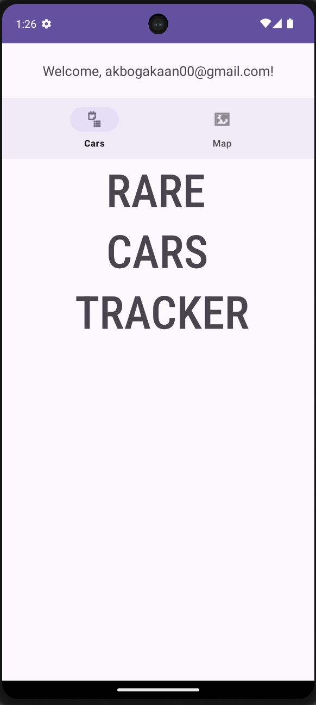
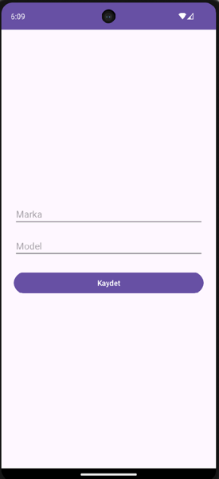

# Rare Cars Tracker 🚗📍

An Android application that allows users to log in, view rare car sightings, and display their locations on a Google Map.

---

## 📸 Screenshots

| Login Screen | Home Screen |
|:-------------:|:-----------:|
|  |  |

| Car List | Map View |
|:--------:|:--------:|
|  |  |

|              Car List              |
|:----------------------------------:|
| |

---

## 📋 Features

- 🔐 **User Authentication** (Firebase Authentication - Email & Password)
- 🏠 **Home Screen** with user greeting and navigation
- 📃 **List of Rare Cars** with brand, model, and location
- 🗺️ **Map View** displaying car locations on Google Maps
- ➕ User Car Submission – Users can now add their own rare cars by providing brand, model, and location information
- 🔒 **Secure Firebase Setup** (API keys and sensitive data protected)

---

## ⚙️ Technologies Used

- Android Studio (Java)
- Firebase Authentication
- Firebase Firestore
- Google Maps SDK for Android
- Material Design Components
- RecyclerView and CardView
- Git & GitHub for Version Control

---

## 🚀 Project Structure

```
/app
    /src
        /main
            /java/com/example/rarecartracker/
                - LoginActivity.java
                - HomeActivity.java
                - ListActivity.java
                - CarAdapter.java
                - CarMapActivity.java
            /res
                /layout
                    - activity_login.xml
                    - activity_home.xml
                    - activity_list.xml
                    - item_car.xml
                    - activity_car_map.xml
```

---

## 🔑 Important Notes

- Sensitive files like `google-services.json` are excluded for security.
- API keys are protected and limited to authorized app package names and SHA-1 fingerprints.

---

## 📥 How to Run

1. Clone this repository:
    ```bash
    git clone https://github.com/yourusername/yourrepo.git
    ```

2. Open the project in Android Studio.

3. Configure your own Firebase project and download the `google-services.json` file into the `app/` directory.

4. Add your Google Maps API key into `google_maps_api.xml`.

5. Run the application on an emulator or Android device.

---

## 📈 Future Improvements

- Car details page with images
- Push notifications for new car sightings
- Filtering cars by brand, model, or distance

---

## 🆕 Update Log

📌 Version 1.1 – June 2025
- Users can now add their own rare cars by providing brand, model, and location information.
- Submitted cars are saved to Firestore and immediately displayed in both the Car List and Map View.
- This marks the app’s first major feature update, enhancing user interaction and expanding the community-driven dataset.

Made by Kaan Akboğa.
